# Passive Wi-Fi Probe Request Fingerprinting Localization Benchmark

[](https://www.python.org/)
[](LICENSE)
[](#citation)
[](REPRODUCIBILITY.md)

This repository accompanies the manuscript **“An End-to-End Pipeline for Passive Wi-Fi Probe Request Fingerprinting-Based Localization with Comparative Evaluation from Classical Retrieval to Attention-Based Models”**, submitted to the *Journal of Network and Computer Applications*.

The repository provides an anonymized passive Wi-Fi probe-request dataset, derived fingerprint matrices, benchmark scripts, reference result tables, paper-output figures, and reproducibility instructions for comparing passive PR fingerprinting localization methods in one controlled indoor testbed.

## Visual Overview

This repository accompanies a benchmark-oriented study of passive Wi-Fi probe-request fingerprinting localization. The figures below summarize the full story, from the passive sensing principle and data-acquisition pipeline to the evaluated model families and key benchmark findings.

### 1. Passive Wi-Fi Probe-Request Fingerprinting

Passive probe-request fingerprinting differs from conventional active Wi-Fi RSS fingerprinting. In the active setting, the user device scans surrounding APs and sends an RSS vector to a localization server. In the passive setting, monitor-mode APs or passive sniffers capture probe-request frames emitted by the device, and the localization pipeline is performed on the infrastructure side.

<p align="center">
  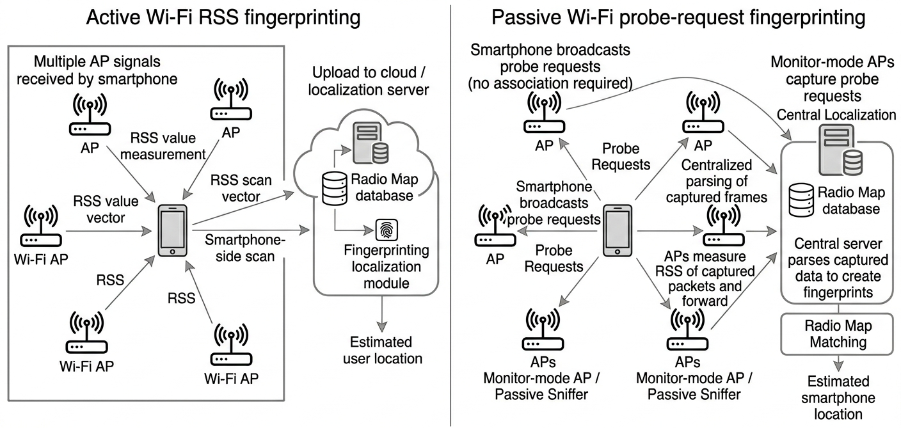
</p>

### 2. End-to-End Benchmark Pipeline

The benchmark follows a unified end-to-end workflow: passive PR data acquisition, centralized packet logging, preprocessing, fingerprint construction, controlled cross-family localization benchmarking, and deployment-sensitivity analysis.

<p align="center">
  
</p>

### 3. Application Context

Passive Wi-Fi probe-request sensing can support infrastructure-side spatial awareness in healthcare, retail, venue management, occupancy analytics, and emergency response. This benchmark focuses specifically on the localization-oriented part of this broader sensing landscape.

<p align="center">
  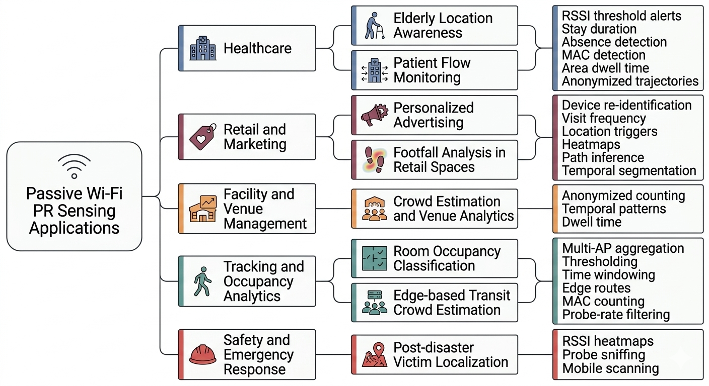
</p>

### 4. Centralized Passive PR Collection

The data-acquisition setup uses multiple monitor-mode AP streams, centralized `ncat` listeners, and separate log files for each AP. This structure enables synchronized multi-AP passive packet capture and reproducible fingerprint construction.

<p align="center">
  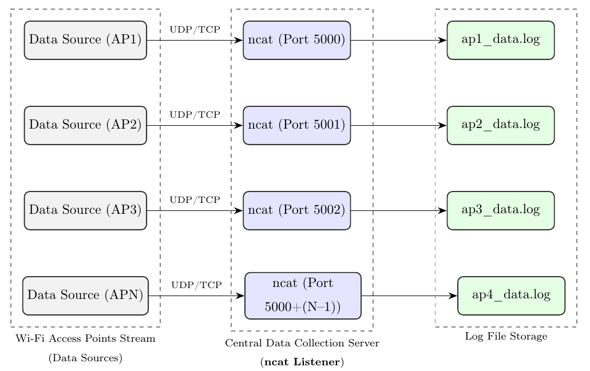
</p>

## Benchmarked Model Families

The repository evaluates representative localization paradigms under the same passive PR fingerprint matrix, train-test split, and coordinate-based evaluation protocol.

### Retrieval-Based and Scalable Fingerprint Matching

The HNSW pipeline accelerates nearest-neighbor retrieval while preserving the fingerprint-matching logic of classical KWNN localization.

<p align="center">
  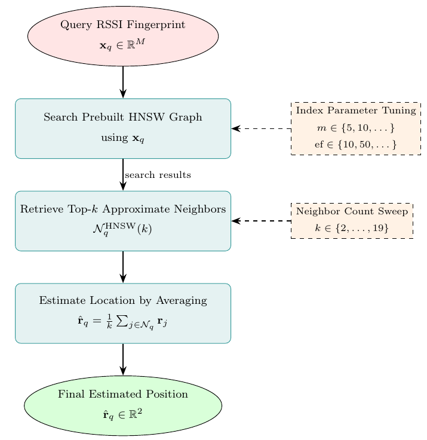
</p>

### Tree-Based Ensemble Models

Tree-based regressors provide nonlinear supervised baselines between classical retrieval and higher-capacity neural models.

<p align="center">
  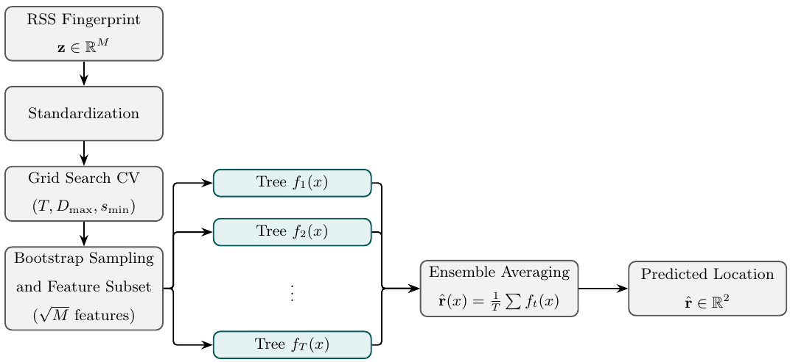
</p>

<p align="center">
  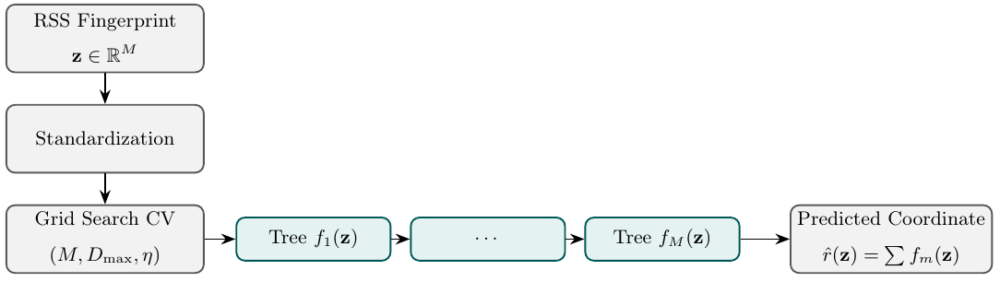
</p>

<p align="center">
  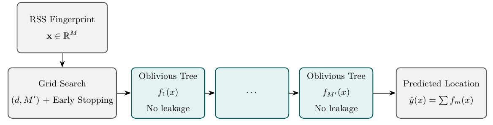
</p>

### Neural and Attention-Based Models

The benchmark also includes MLP-based neural architectures and Transformer-style attention-based models to assess whether higher-capacity learned representations improve passive PR localization under common benchmark conditions.

<p align="center">
  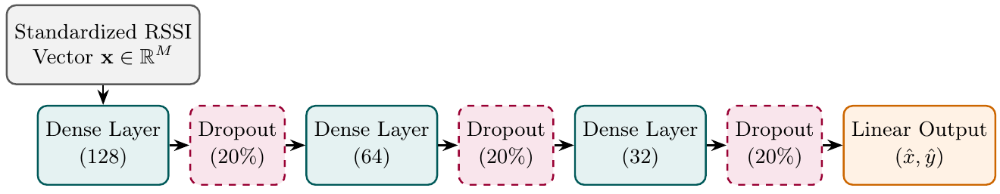
</p>

<p align="center">
  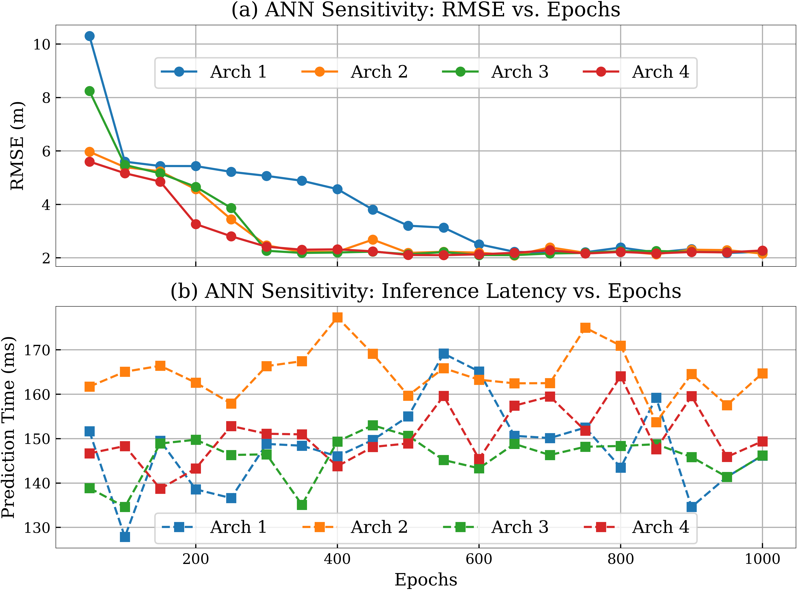
</p>

## Key Benchmark Findings

The benchmark does not support a simple “deeper is always better” conclusion. Instead, the evaluated methods occupy different regions of the accuracy, robustness, latency, and deployment-sensitivity trade-off space.

### Cross-Family Accuracy-Latency Trade-Off

The strongest retrieval methods remain highly competitive for typical-case accuracy and latency. The best-performing attention-based configuration provides favorable large-error control while retaining low inference time.

<p align="center">
  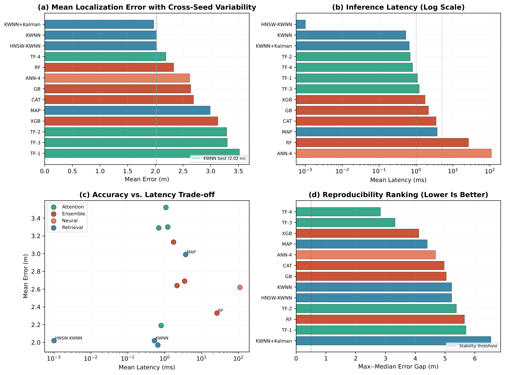
</p>

### Error Distribution Across Method Families

<p align="center">
  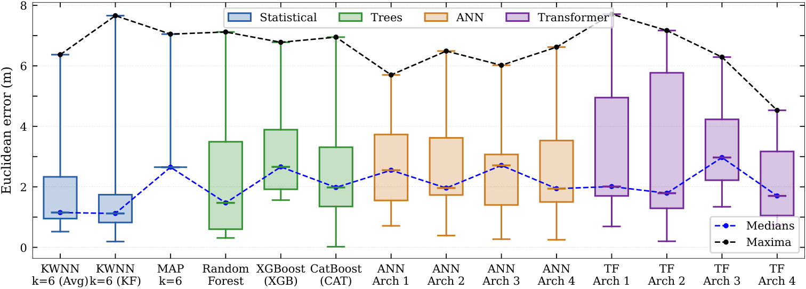
</p>

### Transformer-Family Error Behavior

The Transformer-family results show that attention-based modeling is not automatically superior. The most favorable configuration is the regularized AE+Transformer variant, which reduces the upper-tail error in this benchmark.

<p align="center">
  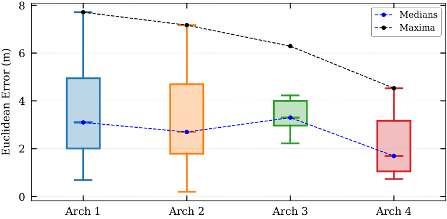
</p>

### Monitor-Node Density and Receiver-Geometry Sensitivity

The deployment-sensitivity analysis shows that localization performance is affected not only by the number of monitor nodes, but also by receiver geometry. These results should be interpreted as within-environment sensitivity findings for the evaluated testbed.

<p align="center">
  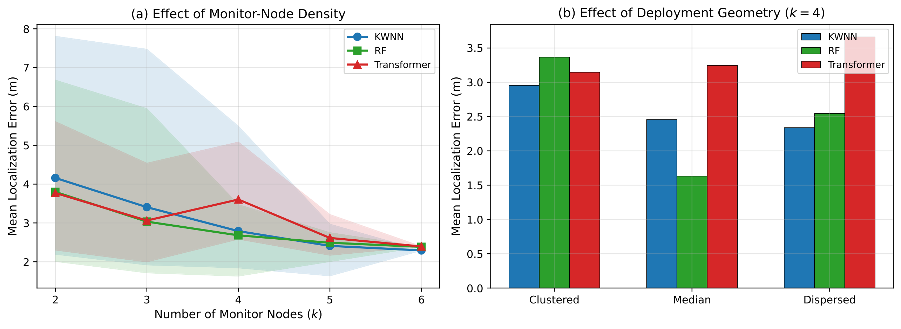
</p>

## Scope of the benchmark

The benchmark is intentionally **single-environment and reproducibility-oriented**. It supports controlled comparison under a fixed data-acquisition and evaluation protocol, but it should not be interpreted as evidence of broad cross-building, cross-device, or cross-deployment generalization.

| Item | Value |
|---|---:|
| Indoor environments | 1 |
| Training/reference locations | 36 |
| Held-out test locations | 9 |
| Monitor nodes / AP columns | 6 |
| Raw training frames | 9,373 |
| Raw test frames | 2,322 |
| Coordinate unit | millimeters in raw/processing, meters in reported errors |

## Repository layout

```text
.
├── configs/                    # Shared experimental constants and hyperparameters
├── data/
│   ├── raw/                    # Anonymized raw passive PR captures
│   ├── processed/              # Aggregated fingerprint matrices for quick reuse
│   └── README.md               # Dataset schema and privacy notes
├── experiments/                # Reproducible benchmark entry points
├── plots/                      # Plotting scripts and selected reference plots
├── paper_outputs/              # Manuscript figures, result tables, and run logs
├── reproducibility/
│   └── paper_charts/           # Chart provenance and reproduction materials
├── results/                    # Executable benchmark outputs
├── scripts/                    # Repository validation and reproduction checks
├── src/                        # Data loading, metrics, models, and utilities
├── tests/                      # Data-integrity and smoke tests
├── CITATION.cff                # Citation metadata
├── DATASET_CARD.md             # Dataset scope, limitations, and ethical notes
├── IDENTIFIER_AUDIT.md         # Identifier-sanitization and legacy-file audit
├── REPRODUCIBILITY.md          # Exact steps for reproducing benchmark outputs
├── RELEASE_VALIDATION.md       # Commands used to check this release
├── requirements.txt            # Core dependencies
├── requirements-full.txt       # Optional full-stack dependencies
└── pyproject.toml              # Project metadata and tooling configuration
```

## Quick start

```bash
# 1. Create and activate an environment
python -m venv .venv
source .venv/bin/activate      # Linux/macOS
# .venv\Scripts\activate       # Windows PowerShell

# 2. Install the core dependencies
python -m pip install --upgrade pip
pip install -r requirements.txt

# 3. Run the fast release-verification path
python scripts/verify_release.py
```

Alternatively, run the main checks step by step:

```bash
python scripts/check_repository.py
python scripts/check_paper_outputs.py
python scripts/check_chart_provenance.py
python scripts/check_chart_reproduction.py
python -m pytest -q -p no:cacheprovider
python experiments/run_kwnn_benchmark.py
```

The release-verification path is designed to be reviewer-friendly and CPU-safe. It checks the repository structure, data integrity, core benchmark execution, and paper-output availability.

## Full benchmark

The extended benchmark includes optional packages such as PyTorch, XGBoost, and CatBoost. Install them only when the corresponding model families are needed:

```bash
pip install -r requirements-full.txt

python experiments/run_all.py --full

# Or run selected components manually
python experiments/run_ensemble_benchmark.py
python experiments/run_mlp_benchmark.py
python experiments/run_transformer_benchmark.py
python experiments/run_latency_benchmark.py
python experiments/run_bootstrap_analysis.py
python experiments/run_ap_density_analysis.py
python plots/generate_all_plots.py
python plots/generate_paper_figures.py
```

Some extended experiments may take longer and can be sensitive to package versions and hardware. TensorFlow/Keras paths are optional and can be installed separately with `requirements-tensorflow.txt` on supported Python/platform combinations. See [`REPRODUCIBILITY.md`](REPRODUCIBILITY.md) for details.

## Data files

The repository includes both raw and processed forms of the anonymized dataset.

| File | Description |
|---|---|
| `data/raw/df_all.csv` | Raw anonymized passive PR frames for the 36 reference locations |
| `data/raw/test_df.csv` | Raw anonymized passive PR frames for the 9 held-out test locations |
| `data/processed/train_fingerprints.csv` | Mean RSSI fingerprint matrix with coordinates for training/reference locations |
| `data/processed/test_fingerprints.csv` | Mean RSSI fingerprint matrix with coordinates for held-out test locations |

The raw files use semicolon separators. The processed files use comma separators and are included to make the benchmark easier to inspect and reuse.

## Data anonymization

The public release does not include the original device MAC addresses or real AP/BSSID identifiers. Device-level identifiers were replaced by deterministic pseudonymous IDs, and AP/BSSID-like identifiers were replaced by generic AP labels such as `ap1`--`ap6`.

Internal legacy notebooks and raw chart-export files that contained original identifiers were excluded from the public release because they are not required for executing the benchmark or regenerating the paper figures. See [`IDENTIFIER_AUDIT.md`](IDENTIFIER_AUDIT.md) for the identifier-sanitization audit.

## Implemented model families

| Family | Representative scripts |
|---|---|
| Weighted nearest-neighbor retrieval | `experiments/run_kwnn_benchmark.py` |
| Tree ensembles | `experiments/run_ensemble_benchmark.py` |
| Neural MLP models | `experiments/run_mlp_benchmark.py` |
| Attention-based models | `experiments/run_transformer_benchmark.py` |
| Latency evaluation | `experiments/run_latency_benchmark.py` |
| Bootstrap uncertainty summaries | `experiments/run_bootstrap_analysis.py` |
| Monitor-node density sensitivity | `experiments/run_ap_density_analysis.py` |

## Paper-output archive

The manuscript-facing outputs are included under [`paper_outputs/`](paper_outputs/):

| Folder/file | Purpose |
|---|---|
| `paper_outputs/figures/` | Figure files using the same filenames referenced in the manuscript |
| `paper_outputs/results/` | Generated per-point outputs and paper-reference aggregate tables |
| `paper_outputs/logs/` | Command logs from release validation and figure generation |
| `paper_outputs/results/paper_figure_manifest.csv` | Machine-readable check that all manuscript figure files are present |

The repository separates **executable release verification** from the **paper-output archive**. The executable path is compact and CPU-friendly so that reviewers can check the repository quickly. The paper-output archive preserves the manuscript-facing result tables and all figure files, including reference aggregate values for neural and attention-based experiments that can be hardware- and package-version-sensitive.

## Paper-chart reproduction

The repository includes a chart-level reproduction layer that maps submitted paper figures to their plotting scripts and regenerates the manuscript-facing chart files. From the repository root, run:

```bash
python reproducibility/paper_charts/standalone_scripts/generate_all_paper_charts.py
python scripts/check_chart_reproduction.py
```

The regenerated figures are saved in:

```text
reproducibility/paper_charts/generated_figures/
```

and copied to:

```text
paper_outputs/figures/
```

The provenance table is available at:

```text
reproducibility/paper_charts/CHART_SOURCE_MAP.csv
```

## Reference results

Executable benchmark outputs are provided under [`results/`](results/). Manuscript-facing reference tables are archived under [`paper_outputs/results/`](paper_outputs/results/). New runs may overwrite files in `results/`; use `paper_outputs/` for the stable paper-output archive.

## Limitations

This benchmark uses one indoor environment, six monitor nodes, 36 reference locations, and 9 held-out test locations. It is designed for controlled within-environment comparison and reproducibility. Model rankings, confidence intervals, latency measurements, and deployment-sensitivity results should therefore be interpreted within the evaluated testbed rather than as universal conclusions across buildings, devices, floors, or receiver layouts.

## Privacy and ethics

The raw data distributed here have been anonymized before release. Original device identifiers and AP/BSSID-like identifiers are not included in the public files. The benchmark uses only the signal, frequency, timestamp, AP-label, location, and coordinate fields required for reproducibility. See [`DATASET_CARD.md`](DATASET_CARD.md) and [`IDENTIFIER_AUDIT.md`](IDENTIFIER_AUDIT.md) for scope, limitations, and identifier-sanitization details.

## Citation

If you use this dataset, code, or paper-output archive, please cite the associated manuscript. Citation metadata is provided in [`CITATION.cff`](CITATION.cff).

```bibtex
@article{elrifaee2026passivepr,
  title   = {An End-to-End Pipeline for Passive Wi-Fi Probe Request Fingerprinting-Based Localization with Comparative Evaluation from Classical Retrieval to Attention-Based Models},
  author  = {Elrifaee, Mohamed and Mansour, Ahmed and Zayed, Tarek},
  journal = {Journal of Network and Computer Applications},
  year    = {2026},
  note    = {Under review}
}
```

## License

Unless otherwise noted, this repository is released under the Creative Commons
Attribution 4.0 International License (CC BY 4.0). This applies to the code,
anonymized dataset, result tables, and figure-reproduction materials included
in the repository.
